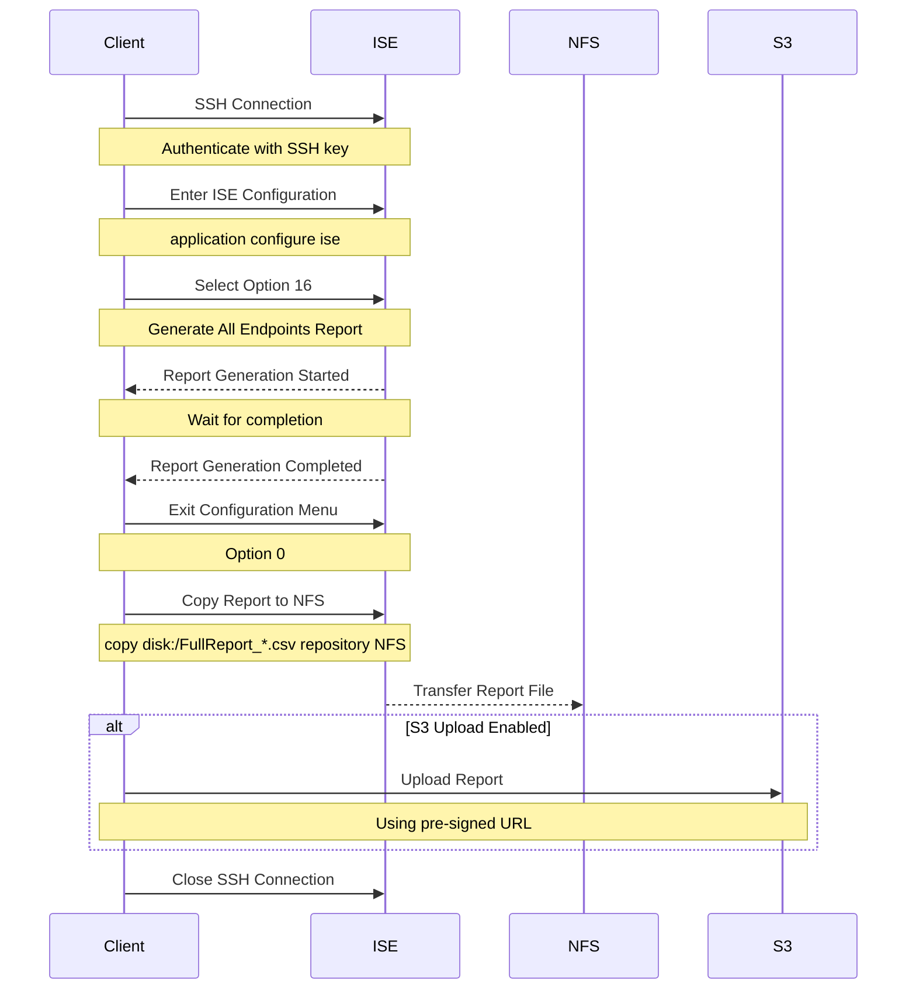

# ISE Endpoints Export CLI

This tool automates the process of exporting endpoint data from Cisco ISE (Identity Services Engine) to an NFS (or SFTP, etc.) repository and optionally uploading it to an S3 bucket.

Note: The recommended programmatic way to export all endpoints’ attributes is using [pxGrid](https://github.com/cisco-pxgrid/pxgrid-rest-ws/wiki/Endpoint), which is available starting from ISE 3.3. If you are on a prior ISE version or need to automate the CLI CSV export for some other reason, this tool is suitable for you.

Note 2: I created version 2 of the script `ise-export-v2.py` which has the following improvements:
	- Switched from hardcoded variables to .env file configuration
	- Added support for multiple environments (prod/staging/dev) via command-line argument (we will adapt to your cluster names)
	- Replaced pre-signed URL S3 upload with direct boto3 integration
	- Added AWS credentials validation before execution
	- Removed hardcoded ISE hostname and credentials
	- Added environment-specific .env file support (.env.prod, .env.staging, etc.)
	- Added proper S3 bucket and region configuration through environment variables
	- Changed from curl to boto3 for S3 uploads

I keep the original version `ise-export.py` untouched for anyone who needs quick and simple way to automate the export. I did not have time to update the readme for V2, yet. Hope you can figure it out :)

## Prerequisites

- Python 3.6 or higher
- SSH access to ISE server
- SSH key pair for authentication
- NFS repository access
- (Optional) AWS S3 bucket with [pre-signed URL](https://docs.aws.amazon.com/AmazonS3/latest/userguide/ShareObjectPreSignedURL.html) (or another method) for upload

## Installation

1. Clone the repository:
```bash
git clone <repository-url>
cd ise-endpoints-cli
```

2. Install required dependencies:
```bash
pip install -r requirements.txt
```

3. Configure SSH key:
```bash
# Generate SSH key if you don't have one
ssh-keygen -t rsa -b 4096 -f ~/.ssh/ise

# Copy public key to ISE repository, then execute on ISE:
crypto key import ise.pub repository NFS
conf t
service sshd PubkeyAuthentication
```

4. Update configuration in `ise-export.py`:
```python
ISE_HOST = "your-ise-host"
ISE_USER = "iseadmin"
ISE_KEY = os.path.expanduser("~/.ssh/ise")
NFS_PATH = "/path/to/nfs/share"
PRESIGNED_URL = "your-s3-presigned-url"  # Optional
```

## Usage

Run the script:
```bash
./ise-export.py
```

The script will:
1. Connect to ISE server
2. Generate endpoint report
3. Copy report to NFS repository
4. (Optional) Upload to S3 bucket

## Workflow Diagram



## Logging

The script generates detailed logs in `ise_export.log` and also displays output on the console. Log entries include:
- Connection status
- Command execution
- Report generation progress
- File transfer status
- Any errors encountered

## Error Handling

The script includes error handling for:
- SSH connection issues
- Command execution failures
- Report generation timeouts
- File transfer problems
- S3 upload errors

## Scheduling

To run the script automatically, add it to crontab:

```bash
# Run daily at 2 AM
0 2 * * * /path/to/ise-export.py
```

## Troubleshooting

Common issues and solutions:

1. SSH Connection Failed
   - Verify SSH key permissions
   - Check ISE host accessibility
   - Confirm user credentials

2. Report Generation Timeout
   - Increase timeout values in script
   - Check ISE server load
   - Verify network connectivity

3. NFS Transfer Failed
   - Verify NFS mount point
   - Check permissions
   - Confirm available space

4. S3 Upload Failed
   - Verify pre-signed URL validity
   - Check AWS credentials
   - Confirm file existence

## License

This project is licensed under the MIT License - see the LICENSE file for details. 